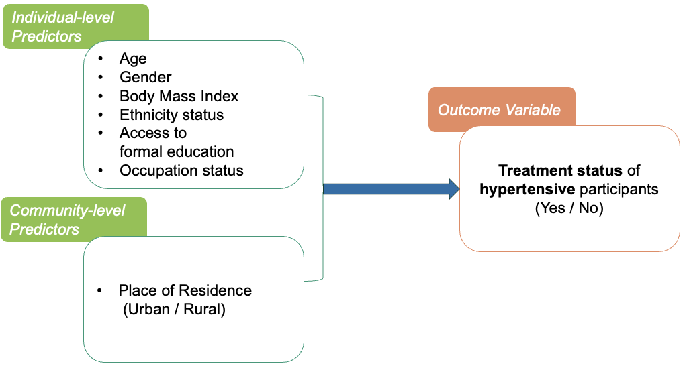

<h1 style="color:darkgreen; text-align:center;">
Poster Presentation 2024
</h1>

<h2 style="color:#278d96;text-decoration:underline;;text-align:left;">
Study Variables
</h2>

<small style="color:black; text-align:center;display:block">
Figure 1: Study Variables
</small>

 

<strong>Definition of the individual-level Variables</strong>
#### 1.	Age Category 
Age has been divided into three categories: 
- Less than 35 years (Youngest age group)
- 35 to 59 years (Middle age group)
- More or equal to 60 years (Oldest age group)
#### 2. Sex
This variable has two categories:
- Male
- Female
#### 3.	Place of Residence
This variable has two categories:
- Urban 
- Rural
#### 4.	Body Mass Index (BMI)
The height (in centimeters) and weight (in kilograms) of the participants were measured and using them the BMI was calculated accordingly:
- Underweight: BMI less than 18.5 kg/m2 
- Normal weight: BMI 18.5 – 24.9 kg/m2
- Overweight: BMI 25.0 – 30.0 kg/m2 
- Obesity: BMI more than 30 kg/m2
#### 5.	Ethnicity
According to the Nepal National Census 20211, the number of caste and ethnic groups in Nepal is 142. These caste or ethnic groups are divided into six main groups. According to the social and economic well-being, in this study, we have further divided the ethnic groups into four categories. The following are the categories:
- Upper caste: Upper caste ethnic groups only.
- Relatively advantaged: Relatively advantaged janajati.
- Disadvantaged: Disadvantaged Janajatis and Disadvantaged non-Dalit Terai caste groups.
- Most disadvantaged: Dalit and Religious Minority.
#### 6.	Formal Education
In the Population-based Prevalence survey2, participants were asked about their highest level of education in terms of Illiterate, No formal schooling, and formal schooling. In the study, we have recategorized the responses in the following way:
- Formal Education (Yes): Access to formal education.
- ormal Education (No): Access to informal education and illiterate.
#### 7.	Occupation Status
Due to Nepal’s geographical structure, sometimes it becomes difficult to reach health posts to get medication regularly. So, we have categorized the occupation status based on whether the participants travel to their respective workplaces and if they are employed at a stable job that requires a regular commute to the workplace. The categories are the following:
- Institutional: This category comprises Government employees, non-government employees, Students, and Self-employed participants.
- Non-institutional: Agriculture, Labor, Homemaker, Unemployed, Retired.

<strong>Response Variable</strong>

#### Hypertension Treatment Status
Respondents were asked whether, during the past two weeks of the day 1 interview, they have been treated with raised blood pressure medications prescribed by a doctor or any other health worker and has been considered as the treatment status. It is a binary variable with “Yes” or “No” responses.
#### Hypertension Measurement
The mean of systolic and diastolic blood pressure was estimated based on the three readings taken in three minutes intervals. Respondents having systolic blood pressure of more than 140 mmHg and/or diastolic blood pressure of more than 90 mmHg and/or currently under medication for hypertension have been categorized as ‘Raised Blood Pressure’ and measured as ‘hypertension’.

<strong>Definition of the community-level Variables</strong>

For the Prevalence study, the community-level variables are:
- Province: There are 7 Provinces in Nepal, the highest geographical cluster.
- District: There are 77 districts in Nepal. However, we have used 75 districts following the dataset in this study. 
- Wards: In the study, we have used 400 wards, the lowest geographical cluster.

For the STEPS study, the community-level variables are:
- Province: Highest geographical cluster.
- Wards: In the study, we have used 259 wards. Lowest geographical cluster.

<h2 style="color:#278d96;text-decoration:underline;;text-align:left;">
Weighted Proportions by Treatment Status
</h2>
The following table represents the weighted proportions of the socio-demographic characteristics by the treatment status from both the studies.

<small style="color:black; text-align:center;display:block">
Figure 2: Weighted Proportions by Treatment Status
</small>
<h2 style="color:#278d96;text-decoration:underline;;text-align:left;">
Additional Charts
</h2>
<strong>1. Structure of the Hierarchical Dataset</strong>

<small style="color:black; text-align:center;display:block">
Figure 3: Hierarchical Data Structure
</small>

<strong>2. Province-wise hypertension treatment status</strong>

<small style="color:black; text-align:center;display:block">
Figure 4: Province-wise hypertension treatment status
</small>
The figure shows that, highest treatment was found in Bagmati, the capital of Nepal and the lowest treatment was found in Karnali.

<h2 style="color:#278d96;text-decoration:underline;;text-align:left;">
References
</h2>

1. Nepal Implements Program to Strengthen Noncommunicable Disease Services through
Capacity Building of Health Workers [Internet]. www.who.int. [cited 2024 May 25].
Available from: https://www.who.int/nepal/news/detail/14-12-2022-nepal-implements-program-to-strengthen-noncommunicable-disease-services-through-capacity-building-of-health-workers#:~:text=More%20than%2070%25%20of%20deaths, Accessed 13th April 2024
2. Dhungana RR, Pandey AR, Shrestha N. Trends in the Prevalence, Awareness, Treatment, and Control of Hypertension in Nepal between 2000 and 2025: A Systematic Review and Meta-Analysis. Int J Hypertens. 2021 Mar 2;2021:6610649. doi: 10.1155/2021/6610649. PMID: 33747559; PMCID: PMC7952181.
3. Nepal Health Research Council (2019). Population-Based Prevalence of Selected Non-
Communicable Diseases in Nepal. Kathmandu: Nepal Health Research Council,
Government of Nepal.
4. Dhimal M, Bista B, Bhattara I S, Dixit LP, Hyder MKA, Agrawal N, Rani M, Jha
AK.2020. Report of Non-Communicable Disease Risk Factors: STEPS Survey Nepal 2019. Kathmandu: Nepal Health Research Council.